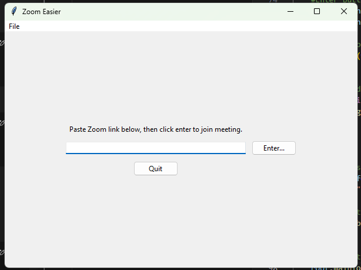

# Zoom Easier

A basic little app to make launching into Zoom meetings a bit easier. 

---

## Description



Written in Python with Tkinter, the main point of the app is to allow quick launching of Zoom meetings by the invite link. 

The history option will allow quickly jumping back to previous meetings.

The application can be extremely helpful for those not fully familiar and/or comfortable with Zoom's UI. 

---

## Features
- Easy meeting launches with Zoom 
- History in json with timestamps for rapid recall of previous meetings

---

## Installation

- Beta build currently available for ease of use (v 0.1.0)

```bash
#Clone the repo
git clone https://github.com/spiritualhost/ZoomEasier.git

#Move into directory
cd ZoomEasier

#Install dependencies
#***Needs to be added

```

---

Program structure:

- main.py -- tkinter window and related formatting
- func.py -- main functions for parsing zoom info and starting meetings
- compatibility.py -- check for system compatibility both through presence of Zoom and os


---
## Requirements
- Python 3.x
- Zoom


---

Some credit due to:

- https://stackoverflow.com/questions/66512222/how-do-i-enable-right-click-in-entry-and-output-widget-for-pasting-and-copying-r
