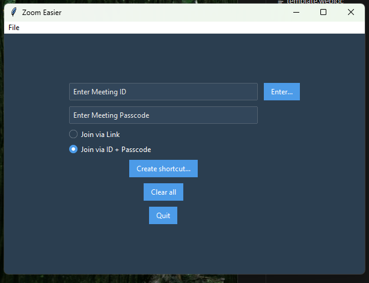
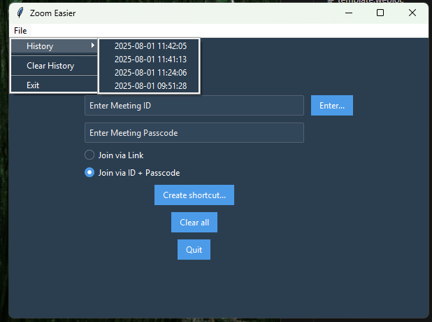
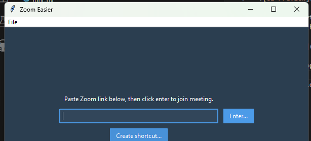

# Zoom Easier

A basic little app to make launching into Zoom meetings a bit easier. 

---

## Description



Written in Python with Tkinter, the main point of the app is to allow quick launching of Zoom meetings by the invite link. 



The history option will allow quickly jumping back to previous meetings.



Easily create desktop shortcuts (Windows) and aliases (MacOS) to jump back in to repeating meetings/rooms. 

The application can be extremely helpful for those not fully familiar and/or comfortable with Zoom's UI. 

---

## Features
- Easy meeting launches with Zoom 
- History in json with timestamps for rapid recall of previous meetings
- Zoom meeting desktop shortcuts

---

## Installation

```bash
#Clone the repo
git clone https://github.com/spiritualhost/ZoomEasier.git

#Move into directory
cd ZoomEasier

#Install dependencies
python.exe install.py

#Install app
#For Windows
pyinstaller --onefile --windowed --name=ZoomEasier --icon=assets/icons/wiz.ico main.py

#For MacOS - this creates a .app bundle
pyinstaller --onefile --windowed --name=ZoomEasier --icon=assets/icons/wiz.icns main.py

```

---

## Program structure:

- main.py -- tkinter window and related formatting
- func.py -- main functions for parsing zoom info and starting meetings
- compatibility.py -- check for system compatibility both through presence of Zoom and os
- historymenu.py -- takes care of handling history reading and writing, handles tkinter dropdown widget
- install.py -- installs python dependencies

---

## Requirements
- Python 3.x (Preferably from the official website, not the Microsoft or Apple store)
- Zoom

---

## Known Issues
- MacOS desktop webloc shortcuts refuse to open directly in Zoom app, instead opening in the browser
- MacOS desktop webloc shortcuts can export as blank and unusable
- MacOS installation issues, ease of installation in general
- Installation of Python dependencies to global environment. This should be fixed for long-term scalability to user machines, but the app was primarily developed for usage on "kiosk" Macs used in conference rooms. 

---

Some credit due to:

- https://stackoverflow.com/questions/66512222/how-do-i-enable-right-click-in-entry-and-output-widget-for-pasting-and-copying-r
